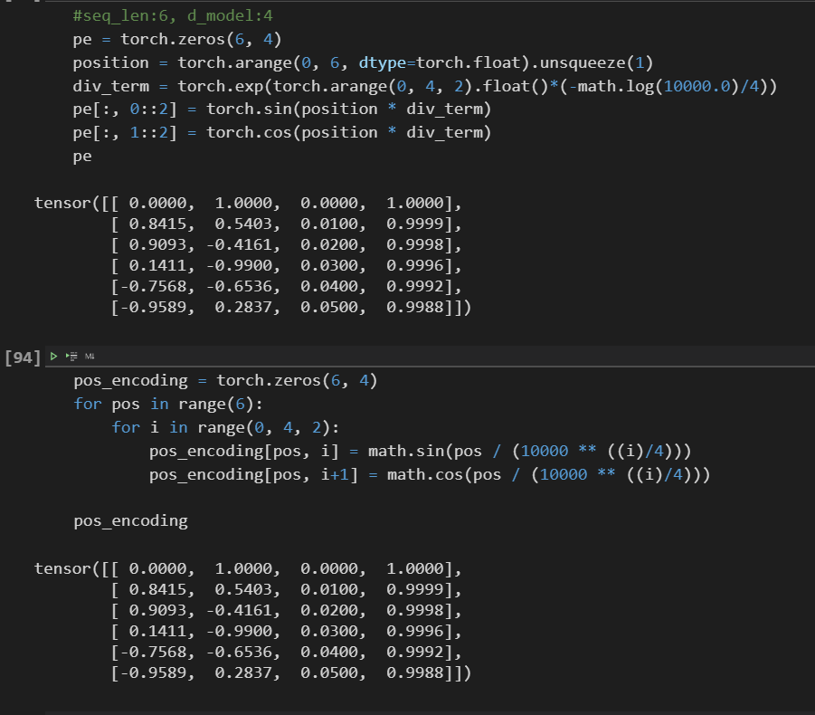

hey i am a nlp beginer.

Please forgive my weak English.

Your tutorial helps me a lot.

I have a quesion in the QANet.ipynb -> Positional Embedding

My thoughts are in the comments below.

```python
class PositionEncoder(nn.Module):
    
    def __init__(self, model_dim, device, max_length=400):
        
        super().__init__()
        
        self.device = device
        
        self.model_dim = model_dim
        
        pos_encoding = torch.zeros(max_length, model_dim)
        
        for pos in range(max_length):
            
            for i in range(0, model_dim, 2):
                
                pos_encoding[pos, i] = math.sin(pos / (10000 ** ((2*i)/model_dim)))
                #pos_encoding[pos, i] = math.sin(pos / (10000 ** ((i)/model_dim)))
                pos_encoding[pos, i+1] = math.cos(pos / (10000 ** ((2*(i+1))/model_dim)))
                #pos_encoding[pos, i+1] = math.sin(pos / (10000 ** ((i)/model_dim)))
            
        
        pos_encoding = pos_encoding.unsqueeze(0).to(device)
        self.register_buffer('pos_encoding', pos_encoding)
        
    
    def forward(self, x):
        #print("PE shape: ", self.pos_encoding.shape)
        #print("PE input: ", x.shape)
        x = x + Variable(self.pos_encoding[:, :x.shape[1]], requires_grad=False)
        #print("PE output: ", x.shape)
        return x
```

And i compare two implements of Positional Embedding.
  
